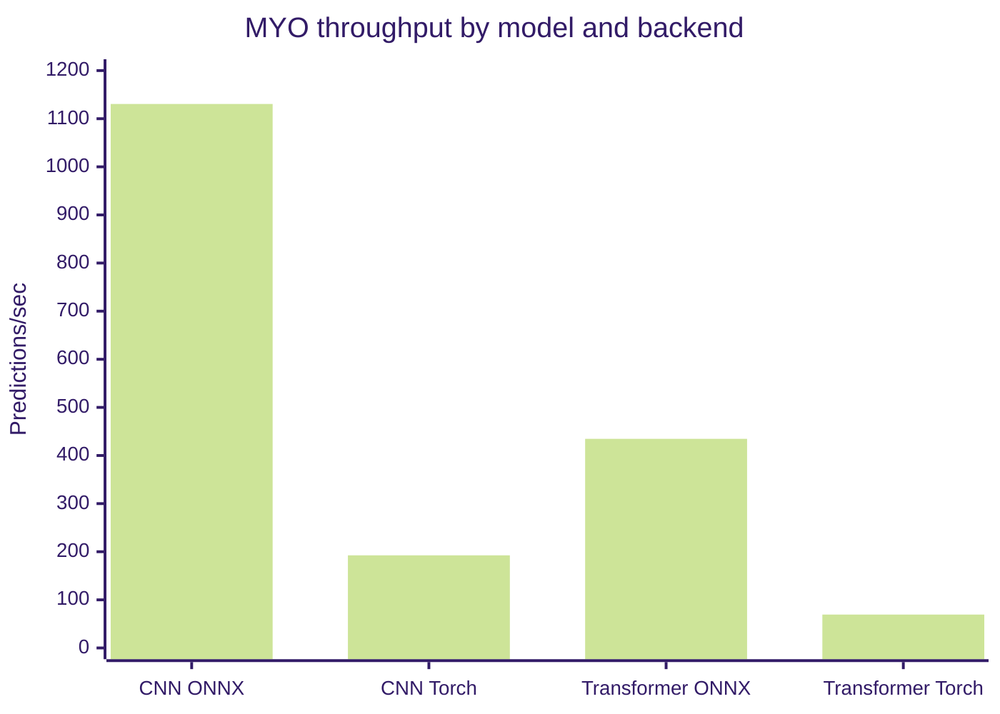
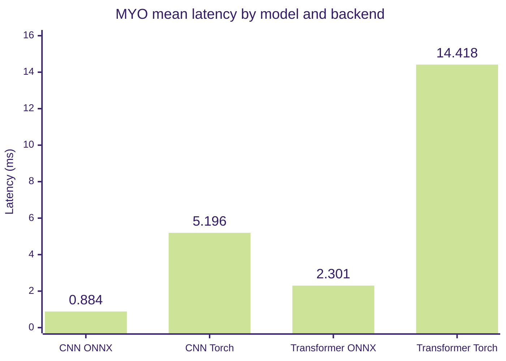
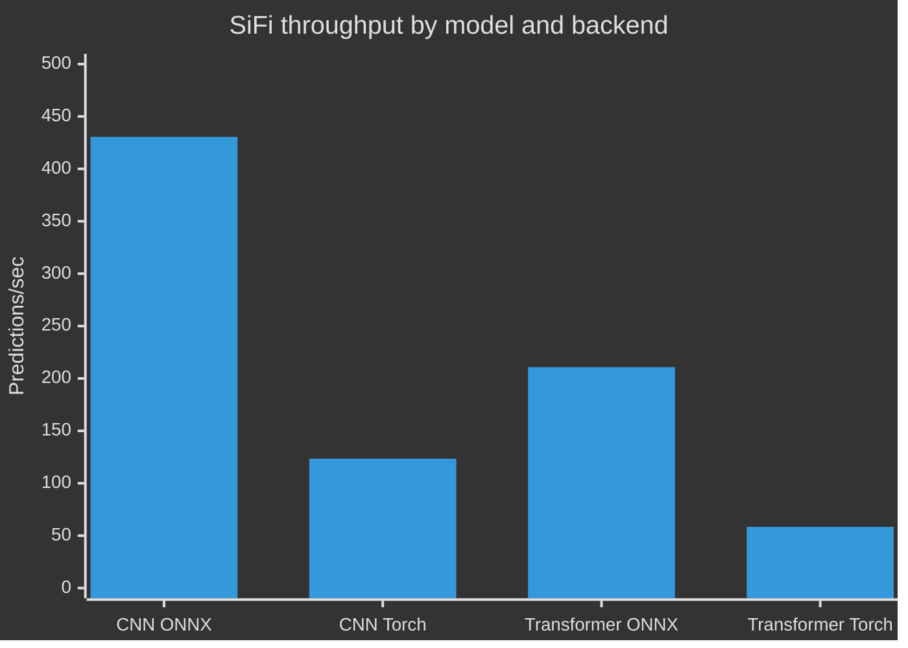
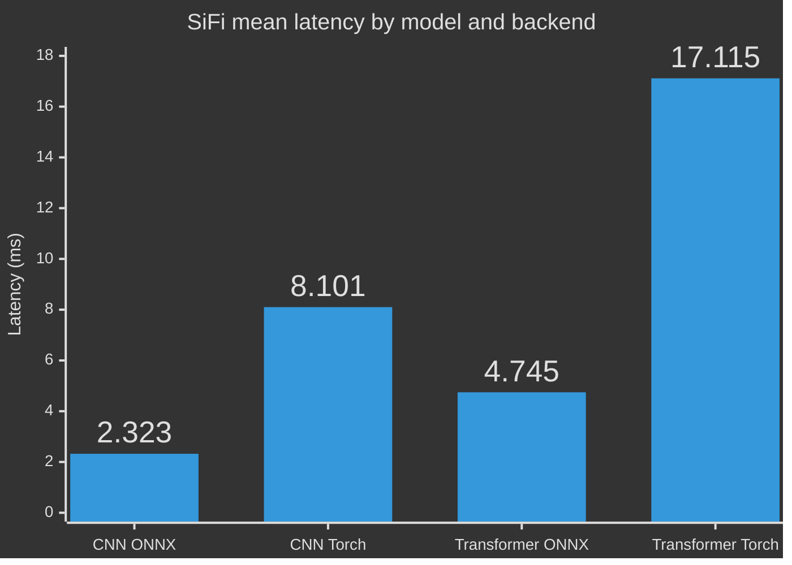

# Inference Benchmarks for QGrip

Benchmark command
> ```bash
> uv run qgrip benchmark data/demo_sifi2/models/02/model.pt --backend <onnx|torch>
> ```

## Executive summary

- ONNX is consistently faster than Torch across every benchmark.
- The best-performing configuration is CNN on MYO with ONNX: 1130.6 predictions/sec.
- The slowest configuration is Transformer on SiFi with Torch: 58.4 predictions/sec.
- For real-time inference, ONNX provides the clearest performance advantage.

## Performance summary table

| Model | Dataset | Backend | Window | Mean latency | P95 latency | Throughput |
| --- | --- | --- | --- | ---: | ---: | ---: |
| CNN | MYO | ONNX | (200, 8) | 0.884 ms | 1.050 ms | 1130.6 pred/s |
| CNN | MYO | Torch | (200, 8) | 5.196 ms | 5.562 ms | 192.5 pred/s |
| CNN | SiFi | ONNX | (1000, 8) | 2.323 ms | 2.729 ms | 430.5 pred/s |
| CNN | SiFi | Torch | (1000, 8) | 8.101 ms | 10.186 ms | 123.4 pred/s |
| Transformer | MYO | ONNX | (200, 8) | 2.301 ms | 2.633 ms | 434.6 pred/s |
| Transformer | MYO | Torch | (200, 8) | 14.418 ms | 16.829 ms | 69.4 pred/s |
| Transformer | SiFi | ONNX | (1000, 8) | 4.745 ms | 7.818 ms | 210.8 pred/s |
| Transformer | SiFi | Torch | (1000, 8) | 17.115 ms | 21.978 ms | 58.4 pred/s |

---

## ONNX throughput: CNN vs Transformer by device

```mermaid

%%{init: {'theme': 'dark'}}%%
xychart
    title "ONNX throughput: CNN vs Transformer (SiFi vs MYO)"
    x-axis ["Myo CNN", "Myo Transformer", "SiFi CNN", "SiFi Transformer"]
    y-axis "Predictions/sec" 0 --> 1200
    bar "MYO" [1130.6, 434.6, 0, 0]
    bar "SiFi" [0, 0, 430.5, 210.8]
```




# MYO

### Throughput



### Latency



### MYO summary

| Model | Backend | Window | Mean latency | Median | P95 | P99 | Throughput |
| --- | --- | --- | ---: | ---: | ---: | ---: | ---: |
| CNN | ONNX | (200, 8) | 0.884 ms | 0.848 ms | 1.050 ms | 1.200 ms | 1130.6 pred/s |
| CNN | Torch | (200, 8) | 5.196 ms | 5.008 ms | 5.562 ms | 11.472 ms | 192.5 pred/s |
| Transformer | ONNX | (200, 8) | 2.301 ms | 2.232 ms | 2.633 ms | 3.217 ms | 434.6 pred/s |
| Transformer | Torch | (200, 8) | 14.418 ms | 13.633 ms | 16.829 ms | 29.002 ms | 69.4 pred/s |

---

# SiFi

### Throughput



### Latency



### SiFi summary

| Model | Backend | Window | Mean latency | Median | P95 | P99 | Throughput |
| --- | --- | --- | ---: | ---: | ---: | ---: | ---: |
| CNN | ONNX | (1000, 8) | 2.323 ms | 2.267 ms | 2.729 ms | 2.921 ms | 430.5 pred/s |
| CNN | Torch | (1000, 8) | 8.101 ms | 7.688 ms | 10.186 ms | 16.028 ms | 123.4 pred/s |
| Transformer | ONNX | (1000, 8) | 4.745 ms | 4.215 ms | 7.818 ms | 9.458 ms | 210.8 pred/s |
| Transformer | Torch | (1000, 8) | 17.115 ms | 15.873 ms | 21.978 ms | 31.799 ms | 58.4 pred/s |

---

## Key takeaways

1. ONNX significantly outperforms Torch in both throughput and latency.
2. CNN models are the fastest overall, especially on MYO data.
3. Transformer models are still viable with ONNX but are noticeably slower under Torch.
4. For low-latency deployment, ONNX is the preferred backend based on these measurements.

## Raw benchmark notes

- CNN / MYO / ONNX: mean latency 0.884 ms, throughput 1130.6 pred/s.
- CNN / SiFi / ONNX: mean latency 2.323 ms, throughput 430.5 pred/s.
- Transformer / MYO / ONNX: mean latency 2.301 ms, throughput 434.6 pred/s.
- Transformer / SiFi / ONNX: mean latency 4.745 ms, throughput 210.8 pred/s.
- Torch remains functional but trails ONNX in every category.
