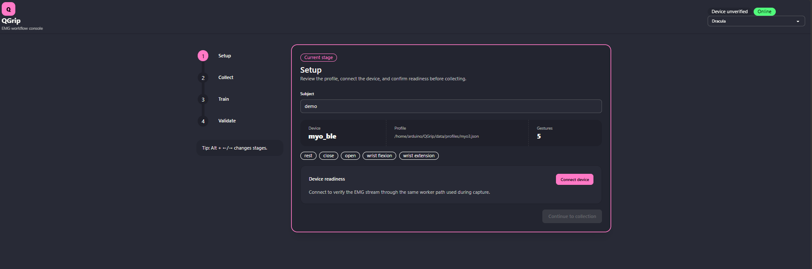

# QGrip


QGrip is a typed Python 3.14 application for collecting EMG data, training and
validating gesture models, and controlling a Handi hand through the Arduino
UNO Q Router. It includes an installable FastAPI/Svelte dashboard and a completely
standalone UNO Q runtime.

QGrip has three ways to use the same workflow services:

- the local web dashboard for guided capture, training, and live validation;
- the `qgrip` command-line interface for scripted or terminal-based workflows; and
- Python services for applications that need to consume real-time predictions directly.

The capture log is the source of truth. Parquet datasets, model checkpoints, ONNX
exports, metadata, and metrics are derived artifacts written under the profile's
`data_root`.

## Get started

The web app is the recommended way to use QGrip. It provides visible prompts for
data collection and guides you through setup, capture, export, training, and live
validation. These instructions assume a source checkout on Windows with
[Python 3.14 or newer](https://www.python.org/downloads/) and
[`uv`](https://docs.astral.sh/uv/getting-started/installation/) installed.




### Web app (recommended)

1. Install QGrip and all optional features from the repository root:

   ```powershell
   uv sync --locked --all-extras --dev
   ```

2. Create a profile for your device. Bare filenames are created under `data/profiles/`.
   Use `synthetic` to try QGrip without hardware:

   ```powershell
   uv run qgrip profile create synthetic.json --device synthetic
   ```

   For a SiFi device, create a SiFi profile instead:

   ```powershell
   uv run qgrip profile create sifi.json --device sifi
   ```

   Myo users can replace `sifi` with `myo_ble` or `myo_dongle`. Open the generated
   profile and review its device settings before continuing with physical hardware.
   The remaining examples use `synthetic.json`; substitute your own profile filename.

3. Download the gesture images used by the collection screen. Passing the profile
   downloads its configured gestures into its configured `assets_root`:

   ```powershell
   uv run qgrip assets download --profile synthetic.json
   ```

4. If you are using SiFi, download the tested SiFi bridge supplied by
   `sifi-streamer`:

   ```powershell
   uv run sifi-download-bridge --tested
   ```

   Skip this step for synthetic and Myo devices. QGrip launches the downloaded
   bridge when it starts a SiFi operation and stops it during orderly shutdown.

5. Validate the profile and check that QGrip can use the configured device:

   ```powershell
   uv run qgrip profile validate synthetic.json
   uv run qgrip doctor --profile synthetic.json
   ```

6. Start the web app:

   ```powershell
   uv run qgrip web --profile synthetic.json
   ```

   QGrip prints a URL similar to:

   ```text
   QGrip dashboard: http://127.0.0.1:8765/?token=...
   ```

   Open the complete printed URL, including `?token=...`, in a browser. Keep the
   terminal running while using QGrip; press `Ctrl+C` there when you are finished.


7. Complete the workflow in the web app:

   1. In **Setup**, enter a subject identifier and select **Connect device**.
   2. In **Collect**, follow the numbered next step shown for the profile's collection mode:
      - For **proportional** collection, complete the required subject calibration first.
        Calibration records rest and maximum effort references for each gesture. When it
        finishes successfully, training-data collection is unlocked.
      - For **discrete** collection, calibration is skipped and training-data collection
        is available immediately.
   3. Start training-data collection and follow the screen-guided gesture prompts.
   4. Export the completed capture to a Parquet training dataset.
   5. In **Train**, select the dataset and a model preset, then wait for training to finish.
   6. In **Validate**, select the generated `.pt` checkpoint and start live inference.
   7. Stop the active job before closing QGrip or giving the device to another workflow.

The collection log is the authoritative recording. Export creates a derived Parquet
dataset, and training writes `model.pt`, `metadata.json`, and `metrics.json` under
`data/<subject>/models/<run-id>/`. When ONNX export succeeds, the same directory also
contains `model.onnx`.

For an installed wheel, omit `uv run` from the commands. The compiled dashboard is
included in the wheel, so Node and the frontend source are not required at runtime.
The profile's `dashboard` section controls the bind address and port, which default to
`127.0.0.1:8765`.

The dashboard API is token-protected. Opening `http://127.0.0.1:8765/` without the
printed token will not connect. The API controls live acquisition; it does not accept
arbitrary EMG windows for one-off prediction.

### CLI workflow

Use the CLI for scripted or externally cued workflows without a browser. Install
QGrip first and download the bridge if you use SiFi; gesture images are optional for
the CLI because it does not display visual prompts. Run `uv run qgrip --help` to see
every command, or follow this end-to-end flow. Replace `synthetic.json` with your
profile and `demo` with your subject identifier:

```powershell
# Create, inspect, and validate a profile.
uv run qgrip profile create synthetic.json --device synthetic
uv run qgrip profile validate synthetic.json
uv run qgrip doctor --profile synthetic.json

# Record a timed SGT session, then derive its training dataset.
uv run qgrip sgt-calibrate demo --profile synthetic.json
uv run qgrip sgt demo --profile synthetic.json
uv run qgrip export demo --profile synthetic.json

# Train using the latest capture for the subject.
uv run qgrip train demo --profile synthetic.json
```

Run `sgt-calibrate` before a subject's proportional collection. The calibration is
required by `sgt` and can be repeated whenever new rest and maximum-effort references
are needed. For a flat discrete capture, skip calibration and add `--discrete` to
`sgt`. Training mode is selected independently, so add `--discrete` to `train` as
well when fitting a discrete model. `export` uses the
subject's latest capture by default, or accepts one or more explicit capture-log
paths. `train` likewise uses the latest capture when `--input` is omitted and derives
its Parquet file automatically if necessary. Repeat `--input <path>` to combine
specific capture logs or Parquet datasets, and use
`--model transformer|cnn1d|cnn2d|dense` to override the profile default.

Capture and training requests are authoritative for proportional/discrete mode. The
dashboard uses the profile's `sgt.proportional` value for collection and training; the
CLI defaults to proportional unless `--discrete` is supplied to both commands.

The CLI `sgt` command follows the configured gesture/trial timing and writes the same
markers as dashboard capture, but it does not render operator cues in the terminal. Use
the dashboard for human data collection that needs visible gesture, preparation, and
activation prompts; use CLI capture for scripted or externally cued operation.

Training creates a run directory under
`data/<subject>/models/<run-id>/` containing `model.pt`, `metadata.json`, and
`metrics.json`. Successful optional ONNX export adds `model.onnx`; a failed export adds
`onnx-error.txt` while preserving the usable Torch checkpoint. These artifacts are
self-describing and are not overwritten.

#### Run live inference from the CLI

Pass the generated checkpoint to `infer`:

```powershell
# Print one accepted prediction as JSON and exit.
uv run qgrip infer data/demo/models/RUN/model.pt --profile synthetic.json --once

# Keep printing accepted predictions until Ctrl+C.
uv run qgrip infer data/demo/models/RUN/model.pt --profile synthetic.json
```

Each emitted JSON object has `gesture`, `confidence`, `activation`, and
`latency_ms`. The CLI checks model/device channel compatibility, uses the profile's
inference cadence, confidence gate, and debounce setting, and prints only accepted
predictions. With `inference.backend` set to `auto`, inference prefers an adjacent
ONNX artifact and falls back to Torch if the artifact or ONNX Runtime cannot be
loaded. `torch` forces the checkpoint backend; `onnx` requires the adjacent ONNX
artifact and fails instead of falling back.

Only one hardware-owning activity may run in a process. Stop CLI inference, a
dashboard job, the Handi runtime, or the HID joystick runtime before starting
another operation that uses the same device.

#### Benchmark inference latency without a device

`benchmark` measures per-call latency and throughput of a checkpoint's `predict`
using synthetic random windows, so it needs no live EMG stream or profile:

```powershell
uv run qgrip benchmark data/demo/models/RUN/model.pt
uv run qgrip benchmark data/demo/models/RUN/model.pt --backend torch --iterations 500 --json
```

It reports mean/median/p95/p99/min/max/stdev latency in milliseconds plus overall
throughput in predictions/sec. `--warmup` (default 20) runs untimed predictions
first so one-time backend setup (CUDA context, ONNX Runtime session, JIT) doesn't
skew the timed iterations. `--backend` selects `auto` (default), `torch`, or `onnx`
the same way `infer` does. `--json` prints a machine-readable result instead of the
text summary.

### Installation groups

The setup above installs every optional dependency. Smaller deployments can select
only the groups they need:

| Group        | Needed for                                                                                   |
|--------------|----------------------------------------------------------------------------------------------|
| base package | profiles, SiFi/synthetic acquisition, capture/export, CLI, and dashboard                     |
| `train`      | Torch training and Torch-backed inference                                                    |
| `onnx`       | ONNX Runtime inference; use with `train` because checkpoint metadata is loaded through Torch |
| `myo`        | Myo BLE or USB-dongle transports                                                             |
| `handi`      | MessagePack RPC to the UNO Q Arduino Router                                                  |

For example, a training workstation that uses SiFi and ONNX can run
`uv sync --locked --extra train --extra onnx`; an UNO Q Handi deployment normally
needs `train`, `onnx`, and `handi`. The standalone HID joystick runtime writes to a
USB HID gadget instead of the Router, so it needs `train` and `onnx` but not `handi`.
The `--all-extras --dev` form remains the simplest source-development setup.

## Use real-time inference from Python

HTTP is not required to access predictions. Create one `LiveEMGSession`, use its
rolling windows as input to `InferenceService`, and consume the returned
`Prediction` values in your own loop. The session owns the streamer acquisition
worker for the lifetime of the `with` block.

```python
import time
from dataclasses import replace

from qgrip.core.profiles import load_profile
from qgrip.capture.streaming import LiveEMGSession, PredictionDebouncer, sample_rates_match
from qgrip.runtime.workflows import InferenceService

profile = load_profile("profile.json")
model = InferenceService("data/demo/models/RUN/model.pt", profile.inference.backend)

with LiveEMGSession(profile.device, profile.acquisition) as session:
    if session.channels != model.channels:
        raise ValueError("model and live stream have different channel counts")
    if not sample_rates_match(session.sample_rate_hz, float(model.metadata["sample_rate_hz"])):
        raise ValueError("model and live stream have different sample rates")

    minimum_new_samples = max(
        1, round(session.sample_rate_hz * profile.inference.inference_period_seconds)
    )
    debouncer = PredictionDebouncer(profile.inference.switch_predictions)

    while True:
        samples = session.next_window(model.window_size, minimum_new_samples)
        if samples is None:
            time.sleep(profile.inference.idle_poll_seconds)
            continue

        prediction = model.predict(samples)
        if prediction.confidence < profile.inference.confidence_gate:
            prediction = replace(prediction, gesture="rest")
        accepted = debouncer.accept(prediction)
        if accepted is not None:
            print(accepted.gesture, accepted.confidence, accepted.activation)
```

`InferenceService.predict()` returns a `Prediction` with `gesture`, `confidence`,
`activation`, and `latency_ms`. It maintains its own model-sized history, but callers
should normally use `LiveEMGSession.next_window()` because it ensures a valid,
contiguous rolling EMG window and resets after device gaps or consumer overruns.
The loop above applies the same confidence gate and debounce behavior as CLI and
dashboard live inference; omit those two steps if an application intentionally
needs every raw model prediction.

For a one-off, already-acquired window, instantiate `InferenceService` and call
`predict()` directly with a tuple of per-sample, per-channel float tuples. A `.pt`
checkpoint is the usual input. A `.onnx` path is also accepted, but its matching
`.pt` checkpoint must be present for the self-describing metadata.

Training is implemented directly in QGrip. The `transformer`, `cnn1d`, `cnn2d`,
and `dense` presets share an `EMGPreprocessor` module that owns normalization and
the windowed-DFT transform. Proportional models learn an activation head; discrete models expose
the same inference contract with activation fixed at `1.0`. Backend selection follows
the profile policy described above.
No scripts or Python modules are loaded from the reference acquisition repository at
runtime.

Myo support uses the attributed PyoMyo source vendored from the reference acquisition
repository; PyoMyo itself is not installed.

## Profiles

Profiles are the editable configuration boundary for QGrip. They compose device,
acquisition, SGT, model, training, inference, dashboard, and optional Handi settings;
the CLI, dashboard, and the standalone Handi and HID joystick runtimes use the same
loaded profile. QGrip
does not select or copy an implicit profile; create one explicitly, then edit it before
running a workflow:

```powershell
qgrip profile create profile.json --device synthetic
```

Replace `synthetic` with `sifi`, `myo_ble`, or `myo_dongle` as appropriate.
Each service reads only its own nested section: SGT reads `sgt` and `acquisition`,
training reads `training` and `model`, and live inference, Handi, and the HID
joystick runtime read `inference` and `acquisition` alongside the device and model
artifacts.

Paths in a profile are resolved relative to the profile file, not the current working
directory. `schema_version` is mandatory and must be exactly `1`; unknown keys and
unsupported enum values are rejected. `rest` must appear among at least two unique
`sgt.gestures`.

The `training` section controls every training parameter. Its timing settings are
deliberately independent: `dataset_stride_seconds` controls overlap between training
examples, `stft_window_seconds` and `stft_hop_seconds` define the spectral frames, and
`inference_period_seconds` in the separate `inference` section controls live output rate.

```json
{
  "training": {
    "epochs": 30,
    "batch_size": 128,
    "learning_rate": 0.0001,
    "validation_fraction": 0.2,
    "training_window_seconds": 1.0,
    "dataset_stride_seconds": 0.005,
    "stft_window_seconds": 0.1,
    "stft_hop_seconds": 0.02,
    "activation_energy_window_seconds": 0.1,
    "activation_reference_quantile": 0.9,
    "activation_smoothing_threshold": 0.25,
    "activation_loss_weight": 1.0,
    "weight_decay": 0.0001,
    "normalization": "dataset_standardize",
    "seed": 42,
    "export_onnx": true
  }
}
```

The default 100 ms STFT analysis window and 20 ms hop resolve to device-rate sample
counts and align exactly with the default one-second model input window. `normalization` is
`signed_8bit` for Myo profiles and `dataset_standardize` for SiFi and other devices;
the latter fits statistics from the training split for proportional and discrete models.
Profile validation rejects unknown keys and invalid ranges before capture, training,
inference, or Handi control begins.

Every exported Parquet row contains `activation_energy`, a causal, channel-demeaned RMS
value over the trailing `activation_energy_window_seconds`; the same method and effective
sample count are stored in Parquet schema metadata. Proportional training uses the energy
on the final row of each model window. After trials are split, the rest median and each gesture's
`activation_reference_quantile` are fitted from training trials only and then applied
to both splits. This avoids leaking validation signal statistics. Rest is fixed at zero,
and gesture activation is clipped between the rest floor and its class reference.
Below `activation_smoothing_threshold`, the classification target moves linearly from
rest to the prompted gesture; unrelated gestures receive no target probability. The
prompted `activation` remains in the derived Parquet data for comparison, and fitted
energy references are recorded in model metadata.

`acquisition` is the shared `sifi-streamer` policy: shared-buffer duration, worker
acknowledgement timeout, capture flush/compression/durability behavior, and nested
signal-health thresholds. `model.architecture` accepts only parameters for the selected
model (for example, Transformer `d_model`, `nhead`, `dim_feedforward`, and `dropout`).
`inference` owns output cadence, confidence/debounce policy, and its short cooperative
waits. The shipped templates provide normal operating values; fields they omit receive
the versioned schema defaults. Use `qgrip profile show <profile.json>` to inspect the
fully resolved document.

## Artifact contracts

QGrip writes one subject tree beneath `data_root`:

```text
<data_root>/<subject>/
├── raw/
│   ├── capture-<UTC timestamp>.capture.jsonl.zst
│   └── capture-<UTC timestamp>.parquet
└── models/
    └── <UTC run timestamp>/
        ├── model.pt
        ├── model.onnx          # when enabled and export succeeds
        ├── metadata.json
        ├── metrics.json
        └── onnx-error.txt      # only when an attempted export fails
```

Subject identifiers may contain only letters, numbers, `-`, and `_`. Capture logs are
append-only authoritative records produced by `sifi-streamer`. Export requires a clean
terminal capture record and keeps only completed, non-superseded SGT presentation
segments; preparation and practice segments are not training data. An existing Parquet
path is never silently replaced.

The canonical Parquet columns are:

- ordering and provenance: `timestamp`, `trial`, `sequence`,
  `sample_index_in_packet`, `capture_file`, `host_monotonic_ns`, and `host_unix_ns`;
- signal identity and health: `device`, `sample_rate_hz`, `samples_lost`, and
  contiguous `channel_0` through `channel_<n-1>`;
- labels: `gesture`, prompted `activation`, and measured `activation_energy`.

For proportional training, schema metadata must declare
`qgrip.activation_energy.method = causal_rms` and the exact energy-window duration and
sample count. Training rejects missing channels, missing provenance fields, mismatched
sample rates, non-finite windows, or energy metadata that disagrees with the profile.
There is deliberately no older-Parquet compatibility path.

`model.pt` is a strict checkpoint contract. It requires `checkpoint_version = 1`, a
supported `model_name`, a canonical `model_config`, model weights, labels, device and
sample-rate metadata, validation metrics, source inputs, and proportional activation
calibration when applicable. Structural values such as window size, channel count,
class count, STFT shape, normalization, and activation-head mode live only in
`model_config`. `metadata.json` is the same document without model weights;
`metrics.json` contains per-epoch training and validation results. Unsupported or
unversioned checkpoints are rejected rather than guessed or migrated.

## Standalone Handi


```powershell
uv run qgrip-rpc-handi --profile handi.json --model data/demo/models/RUN/model.pt
```

The standalone command owns acquisition, inference, the Unix-domain Arduino Router
RPC connection, start pose, movement, and shutdown. The App Lab Brick/sketch lives
separately; configure its repository in
`qgrip.runtime.handi.HANDI_BRICK_REPOSITORY_URL` when published.

`qgrip handi calibrate --profile <path> --output <path>` writes an atomically validated
copy of the loaded profile. Add `--interactive` to instead launch a curses wizard that
connects to the Router, jogs joints or grip-preset positions by hand, and writes the
discovered values back into `--output` on exit:

```powershell
uv run qgrip handi calibrate --profile handi.json --output handi.json --interactive
```

The wizard has two modes, picked from a top-level menu:

- **Find joint range** — pick a joint, then jog it with the arrow keys (Shift+arrow for
  a bigger step) to its EXTEND endpoint and press `s` to save, then repeat for FLEX.
  EXTEND becomes the joint's `minimum` (also its open/start position) and FLEX becomes
  its `maximum`; `d` discards a jog and returns to where it started. This mode moves the
  joint directly and unclamped, since it exists to discover the range in the first
  place — every other joint is retracted to its own known `minimum` first so it stays
  out of the way.
- **Edit grip presets** — pick a preset (sent to the hand via the same clamped
  `HandController` the runtime uses), then pick a joint within it and jog its position,
  `s` to save into that preset or `d` to discard.

`q` (or Ctrl-C) backs out one menu level; from the top level it exits and persists.

An enabled `handi` profile must define at least one joint with `minimum < maximum`.
`minimum` doubles as that joint's startup position (sent once at launch) and its
"fully open" reference for open/close blending — there is no separate `start` or
`open_position` field. Gesture mappings resolve either to incremental `open`/`close`
movement or to a named grip preset. Unmapped gestures update observed prediction state
but do not move the hand. The runtime validates checkpoint/device channels and sample
rate before applying the configured start pose.

Every motor command is clamped to configured joint limits. Each `set_positions` Router
call carries an ordered position for every configured joint; an incremental multi-joint
open/close action currently sends one such call per joint. Stopping QGrip commands does
not disable servo torque and does not replace a physical emergency stop.

## Performance summary table on Arduino UNO Q

| Model | Dataset | Backend | Window | Mean latency | P95 latency | Throughput |
| --- | --- | --- | --- | ---: | ---: | ---: |
| CNN | MYO | ONNX | (200, 8) | 0.884 ms | 1.050 ms | 1130.6 pred/s |
| CNN | MYO | Torch | (200, 8) | 5.196 ms | 5.562 ms | 192.5 pred/s |
| CNN | SiFi | ONNX | (1000, 8) | 2.323 ms | 2.729 ms | 430.5 pred/s |
| CNN | SiFi | Torch | (1000, 8) | 8.101 ms | 10.186 ms | 123.4 pred/s |
| Transformer | MYO | ONNX | (200, 8) | 2.301 ms | 2.633 ms | 434.6 pred/s |
| Transformer | MYO | Torch | (200, 8) | 14.418 ms | 16.829 ms | 69.4 pred/s |
| Transformer | SiFi | ONNX | (1000, 8) | 4.745 ms | 7.818 ms | 210.8 pred/s |
| Transformer | SiFi | Torch | (1000, 8) | 17.115 ms | 21.978 ms | 58.4 pred/s |

---

## ONNX latency: CNN vs Transformer by device

```mermaid

%%{init: {'theme': 'dark'}}%%
xychart
    title "ONNX mean latency: CNN vs Transformer (SiFi vs MYO)"
    x-axis ["Myo CNN", "Myo Transformer", "SiFi CNN", "SiFi Transformer"]
    y-axis "Latency (ms)" 0 --> 5
    bar "MYO" [0.884, 2.301, 0, 0]
    bar "SiFi" [0, 0, 2.323, 4.745]
```




## Standalone HID joystick

```powershell
uv run qgrip-hid --profile synthetic.json --model data/demo/models/RUN/model.pt
```

`qgrip hid` — aliased as the `qgrip-hid` console script — is the standalone
Handi runtime with a different output stage. Acquisition, model loading, the
windowed inference loop, the confidence gate, and prediction debounce are
identical; each accepted prediction is mapped to a signed deflection on one axis
of a USB HID game controller instead of a clamped joint pose over the Arduino
Router RPC socket.

Reports are written to a HID gadget device (`--device`, default `/dev/hidg1`) as
a 4-byte `[X, Y, Z, buttons]` packet. Each mapped gesture drives its own axis —
`open` → X, `close` → Y — scaled between zero and full scale (±127) by the
prediction's proportional `activation`. `rest`, and any gesture with no axis
mapping, sends the neutral all-zero report that recentres the stick. The current
report is re-sent every `inference.inference_period_seconds` tick, so a sustained
contraction reads as a held deflection rather than a single tap. On `Ctrl+C`,
`SIGTERM`, or any error the neutral report is written once more before the device
is closed.

The axis assignment and full-scale value are the `LABEL_TO_AXIS` and `AXIS_MAX`
constants in `qgrip.runtime.hid`; `AXIS_MAX` is a placeholder until the classifier
reports a per-gesture calibrated maximum. The HID gadget device itself (the
joystick `hidg` function) is configured on the host outside QGrip. Like the other
hardware-owning runtimes, the command validates checkpoint/device channel count
and sample rate before streaming, and only one such activity may run in a process
at a time.

## Gesture images

QGrip does not download assets during installation, import, or capture. Download the
seven default gesture images (`rest`, `close`, `open`, wrist flexion/extension, pronation,
and supination) into `assets/images` explicitly:

```powershell
uv run qgrip assets download
```

To download no more than the classes configured in a profile and place them in that
profile's `assets_root`, run:

```powershell
uv run qgrip assets download --profile sifi.json
```

Individual classes can instead be selected by repeating `--gesture`, and `--target`
overrides the output directory:

```powershell
uv run qgrip assets download --gesture rest --gesture open --target assets/images
```

The images are checksum-verified against pinned files from
[LibEMGGestures](https://github.com/LibEMG/LibEMGGestures/tree/c17792f1966f23f7dafda7c47a65012e47a2e7ee).
That project asks image users to cite its work; follow the citation instructions in its
README and review its attribution and licensing before redistribution. QGrip writes the
source revision, checksums, and citation reminder to `manifest.json` beside the images.
Text cues remain fully usable without images.

See [CONTRIBUTING.md](CONTRIBUTING.md) and [ARCHITECTURE.md](ARCHITECTURE.md) before
changing public workflows or hardware lifecycle behavior.
