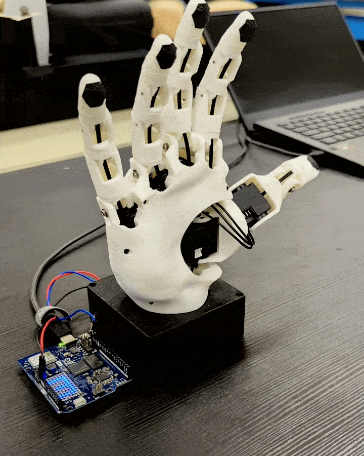
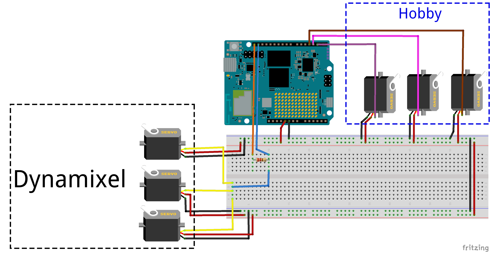

# 🖐️ QGrip — App Lab app

This is the on-board App Lab App: a sketch on the UNO Q's STM32 (MCU side) that
drives a Handi Hand's 6 digit joints, plus a thin Python RPC layer
(`python/main.py`) that exposes the sketch's Router Bridge calls to the rest of
the app. Each joint is independently wired to **either** a DYNAMIXEL X-series
servo **or** a hobby (analog RC) PWM servo, and one sketch drives a hand that
mixes both.

The "what shape should the hand be in" logic — grip shapes/presets, per-digit
drive limits (`JointLimit.minimum`/`maximum`), and range gating — is **not** in
this folder. It lives in `HandController` in the top-level package
(`src/qgrip/runtime/handi.py`), which talks to this app's sketch over the
Router as its RPC transport. See the repository root [README.md](../../README.md)
("Standalone Handi") for that layer.

## Architecture

- **MPU, this app (Python, `python/main.py`)** — a thin pass-through: each
  function wraps one `Bridge.call(...)` to the sketch and returns its result
  (plus a warning log on rejection).
  `TEST_MODE` (see below) drives the hand
  directly for bench testing, bypassing `HandController` entirely.
- **MCU (sketch, `sketch/sketch.ino`)** — a thin position driver. It writes
  whatever it's given straight to each servo (DYNAMIXEL joints get no range
  checking; hobby-servo joints clamp to a servo-safe pulse-width range). It also
  drives the 8×13 LED matrix from frames sent over RPC.

### Per-joint interface selection

Each joint picks its interface via a `JOINT<n>_IS_DYNAMIXEL` define plus a row in
the `JOINT_INTERFACE[]` table (physical DYNAMIXEL bus ID, or Arduino header pin
for a hobby servo). `DYNAMIXEL_ENABLED` / `HOBBY_SERVO_ENABLED` are derived from
those defines by the preprocessor, so a hand that uses only one interface
compiles out the other's library, bus, and pins entirely.

### Joint IDs

Logical joint IDs used over RPC: 1 = thumb rotate, 2 = thumb flex, 3 = index,
4 = middle, 5 = ring, 6 = baby. For DYNAMIXEL joints these map to physical bus
IDs 10-15 (`JOINT_INTERFACE[].dxl_id`); the logical ID is independent of the
physical DYNAMIXEL ID. At boot the sketch runs a collision-free individual ping
sweep of the bus and brings up each servo it finds; a DYNAMIXEL joint missing at
boot is re-pinged in the background every ~2 s and comes online when it responds.

## Wiring

### DYNAMIXEL bus (no shield, no TTL adapter)

DYNAMIXEL's data line is single-wire half-duplex. **D21 (TX)** and **D20 (RX)** —
`Serial3`, the only free hardware UART on the UNO Q headers — are tied together
onto the single DATA wire, with a small series resistor (~150-470 Ω) on the TX
leg. Power the bus from a 5V/4A PSU and tie grounds together.

Because TX and RX share one wire, every transmitted byte echoes straight back
into the MCU's own RX. `sketch/half_duplex_echo_serial.h` wraps `Serial3` to
discard that self-echo before the Dynamixel2Arduino library sees it; the library
itself runs in full-duplex mode (`DXL_DIR_PIN = -1`).

The XL330-M288-T servos are pre-configured in DYNAMIXEL Wizard 2.0 for position
mode with their CW/CCW joint limits set on the servo (EEPROM), not by this
sketch.

### Hobby servos

Any joint set to a hobby servo is driven by a plain PWM signal wire on the
header pin from its `JOINT_INTERFACE[]` row, using the board's native Zephyr PWM
channels at a 20 ms / 50 Hz frame. Pulse widths are clamped to
`SERVO_PULSE_MIN_US`..`SERVO_PULSE_MAX_US`.

## RPC contract (MPU → MCU)

| Call | Returns | Notes |
|---|---|---|
| `set_positions(positions[6])` | `bool` (always `true`) | Normal driving path. One raw goal per joint: DYNAMIXEL units for a DYNAMIXEL joint, pulse width in µs for a hobby-servo joint. Non-blocking. |
| `move_joint(joint_id, goal_position)` | `bool` | Manual single-joint move for bench testing. `false` if the joint ID is invalid or not enabled. |
| `set_led_frame(bytes[104])` | `bool` (always `true`) | 104 grayscale values (0-7), row-major, sent as a MessagePack bin blob. Enqueued for a dedicated draw thread — never blocks the RPC link. |
| `get_position(joint_id)` | `[position, velocity]` | DYNAMIXEL joint: live servo read. Hobby-servo joint: last commanded pulse width, velocity always 0. `[-1, -1]` if the joint ID is invalid/disabled. |

`python/main.py` exposes thin wrappers around each of these. Setting
`TEST_MODE = True` in that file cycles the hand between an open and a closed
shape (raw DYNAMIXEL positions, not a real drive-limit-gated preset) on a
timer, so the sketch and wiring can be bench-tested with
`arduino-app-cli app logs --follow` and no external RPC caller.
